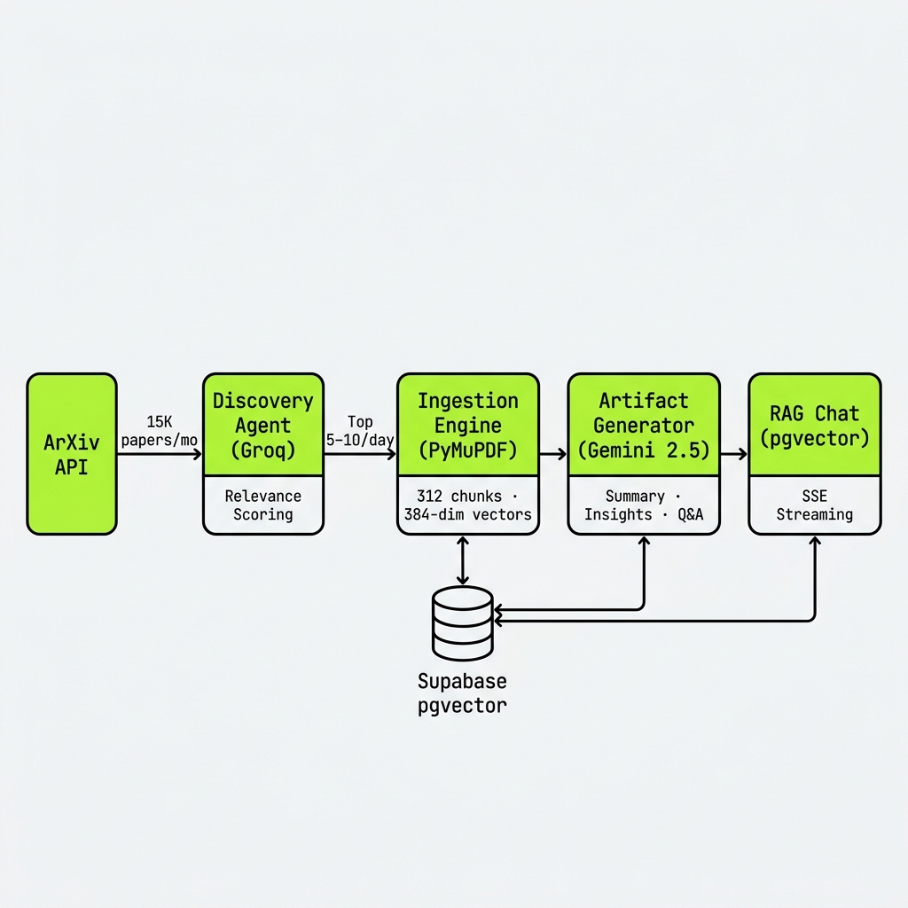
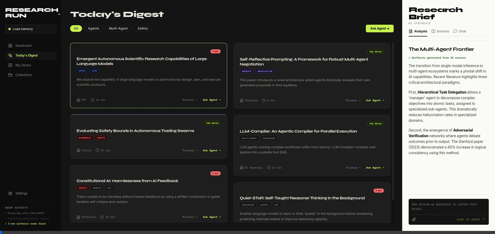

# 🌟 Shouko-AI (PaperBrain) — Advanced Academic Research Assistant

A premium, state-of-the-art agentic platform designed to streamline academic research. Shouko-AI automatically discovers daily research papers, builds deep-dive interactive artifacts, and enables real-time, high-performance RAG chat.

---

## 🚀 Key Features

* **🤖 Agentic Daily Discovery & Digests**: Automatically scans ArXiv by user-defined categories, scoring and filtering new papers against personal interest profiles using LLM-based analysis (Groq/Llama 3.1 8B).
* **📄 Deep PDF Ingestion Pipeline**: Downloads PDFs, extracts high-fidelity text via PyMuPDF, chunks text using a sliding window (512 words, 50 overlap) with section-boundary heuristics, and generates high-dimensional embeddings.
* **🔬 High-Fidelity Artifacts**: Uses advanced agentic workflows (Gemini 1.5 Flash) to analyze paper chunks section-by-section, creating structured JSONB summaries, key takeaways, auto-generated Q&As, and suggested follow-up experiments.
* **💬 Interactive RAG Streaming**: High-performance Server-Sent Events (SSE) streaming chat that queries paper chunks using pgvector cosine similarity, persisting conversation history.
* **📂 Collections & Library**: Real-time organization tools allowing users to catalog, tag, and group paper artifacts into color-coded collections.
* **💳 Subscription & Billing**: A fully integrated billing system using Stripe Checkout and Stripe Billing Portal, managed via real-time Stripe Webhooks for subscription lifecycles.
* **🔒 Tiered Usage & Rate Limiting**: Robust Redis-backed sliding-window rate limiters and automated usage tracking that enforces daily/monthly quotas for free and pro plans.
* **✉️ Premium Onboarding & Notifications**: Beautifully compiled, responsive HTML daily digest emails delivered via Resend.

---

## 🏗️ Architecture Overview

Shouko-AI is structured as a modern monorepo with a decoupled Next.js frontend and FastAPI backend, coordinated via Celery background tasks and Redis.



### Technology Stack
* **Frontend**: Next.js 14 (TypeScript), Tailwind CSS, TanStack Query (React Query), Supabase Auth, shadcn/ui.
* **Backend**: FastAPI (Python), SQLAlchemy, Alembic (Migrations), Celery (Background Tasks), Redis (Task Broker, Caching, Rate Limiting), pgvector (Vector Search).
* **AI Engines**: Groq (Llama 3.1), Gemini 1.5 Flash, OpenRouter/OpenAI Embeddings, Resend.

---

## 📂 Project Structure

```text
paperbrain-ai/
├── apps/
│   ├── api/                 # FastAPI Backend
│   │   ├── agents/          # LLM Agents (Discovery, Artifact Generation)
│   │   ├── alembic/         # Database Migrations
│   │   ├── core/            # Config, DB connections, Rate Limiting, Security
│   │   ├── models/          # SQLAlchemy Database Models (9 models)
│   │   ├── prompts/         # Versioned LLM prompts
│   │   ├── routers/         # API Endpoints (Papers, Chat, Billing, etc.)
│   │   ├── services/        # Business Logic (Ingestion, RAG, Email, Stripe)
│   │   ├── tasks/           # Celery Workers & Tasks
│   │   └── tests/           # Integration & Smoke Tests
│   └── web/                 # Next.js 14 Frontend
│       ├── app/             # App Router Pages & Layouts
│       ├── components/      # UI, Chat, Artifact, & Layout Components
│       ├── hooks/           # TanStack Query & SSE Hooks
│       ├── lib/             # API Client, Supabase Browser/Server Clients
│       └── types/           # TypeScript Interfaces
├── Images/                  # Branding & Asset Gallery
├── infrastructure/          # Docker & Nginx Production Configs
└── docker-compose.yml       # Local Development Infrastructure (Postgres + Redis)
```

---

## 🕸️ Draggable Knowledge Graph & Mindmap Canvas

Shouko-AI turns dense, text-heavy academic literature into a highly intuitive, interactive knowledge landscape. The frontend features an advanced, draggable, and zoomable node-based **Mindmap Canvas** that visually maps out papers, core concepts, and key insights.

Researchers can drag nodes, expand connections, and traverse the relationship graph between different papers—making literature reviews a spatial and interactive experience rather than a linear list of search results.



---

## 🧠 Deep-Dive: The Agentic Core

Shouko-AI is driven by two highly specialized autonomous agents that work in concert to filter and synthesize academic knowledge:

### 1. The ArXiv Discovery Agent
* **Purpose**: To scan the daily influx of new research and find the high-signal papers matching the user's research interests.
* **Mechanism**: Powered by **Groq (Llama 3.1 8B)** (with fallback chains), it evaluates paper titles, abstracts, and metadata. Rather than simple keyword matching, it scores each paper's relevance, difficulty, and impact on a structured rubric, filtering out low-quality uploads and delivering a highly personalized **Daily Digest** directly to the user's dashboard and email.

### 2. The Artifact Generation Agent
* **Purpose**: To build a comprehensive, high-fidelity synthesis (an "Artifact") of an ingested paper.
* **Mechanism**: Driven by **Gemini 1.5 Flash**, the agent reads the paper's extracted text chunks section-by-section. It synthesizes a structured breakdown containing:
  * A high-level executive summary.
  * Key insights and core contributions.
  * An automated Q&A set covering methodology, findings, and limitations.
  * Suggested follow-up experiments to inspire future research.
  * These artifacts are stored as rich JSONB documents, ensuring near-instantaneous load times and a highly structured UI presentation.

---

## 💬 Deep-Dive: Context-Aware RAG & SSE Streaming

When a researcher asks a question about an artifact, Shouko-AI utilizes a custom Retrieval-Augmented Generation (RAG) pipeline to provide precise, fact-grounded answers:

1. **pgvector Context Retrieval**: The user's query is converted to a vector embedding and matched against the paper's stored chunks using high-performance **pgvector cosine similarity**.
2. **Multi-Provider Fallback Chat**: The top matching text chunks, alongside full conversation history, are formatted into a context-rich prompt and sent to the LLM (OpenRouter → Gemini → Anthropic → Mock).
3. **Server-Sent Events (SSE) Streaming**: Answers are streamed token-by-token back to the Next.js frontend over a persistent SSE connection, creating a responsive, ChatGPT-like conversational interface.

---

## 🔒 Environment & Integrations Reference

Shouko-AI integrates several industry-leading APIs and services to power its workflows:

### Backend Integrations (`apps/api/.env`)
* **Supabase JWT Auth**: Automatically validates incoming requests via RS256/JWKS public keys, creating a local user profile in the Postgres database upon their first successful Google or Email login.
* **Stripe Subscriptions**: Manages the upgrade path to the Pro plan. Generates checkout and customer billing portal sessions, and updates user tier limits in real time by listening to Stripe webhook events.
* **Resend Email Engine**: Compiles and sends a beautifully designed, responsive HTML email version of the Daily Digest.
* **Redis Caching & Limits**: Handles token-bucket rate limiting and coordinates asynchronous Celery tasks for PDF downloads and ingestion.

### Frontend Integrations (`apps/web/.env.local`)
* **Supabase Browser Client**: Standardizes user authentication states, Google OAuth redirects, and route protection via Next.js middleware.
* **FastAPI Gateway**: Connects directly to the backend API, automatically injecting authorization headers into requests.

---

## 📄 License

This project is licensed under the MIT License.
