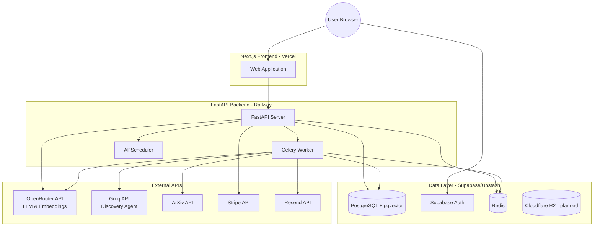
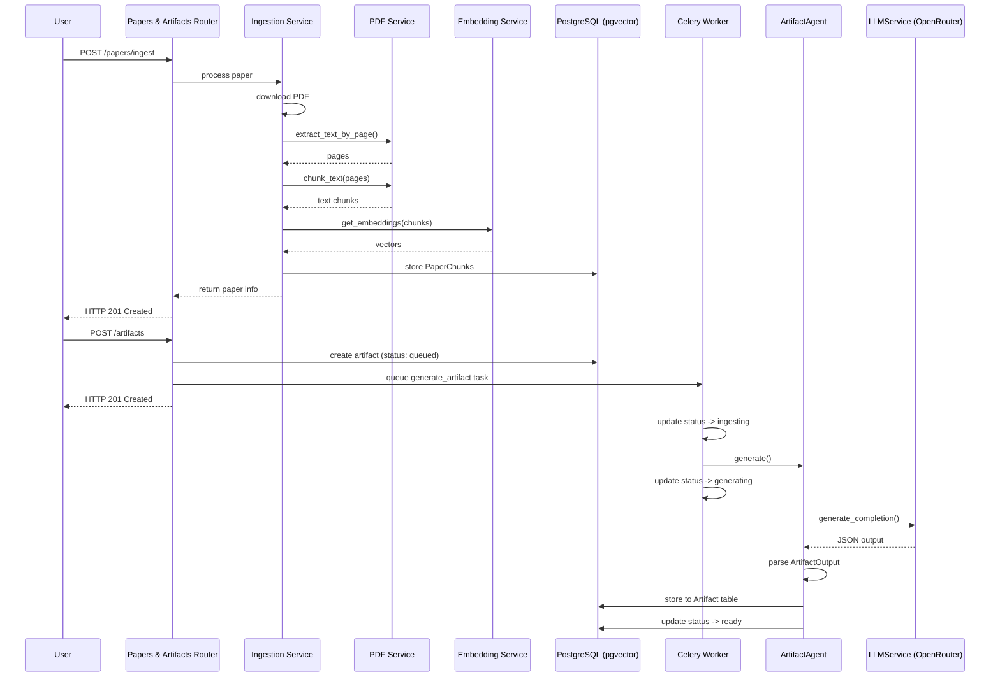
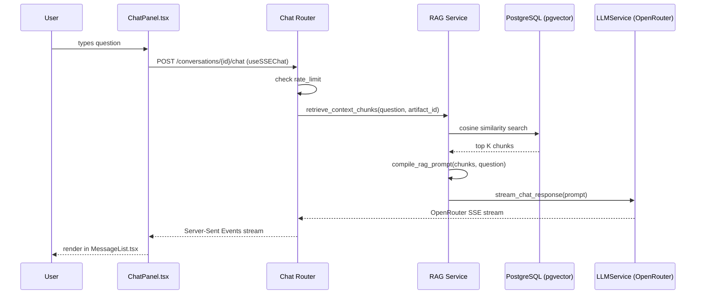
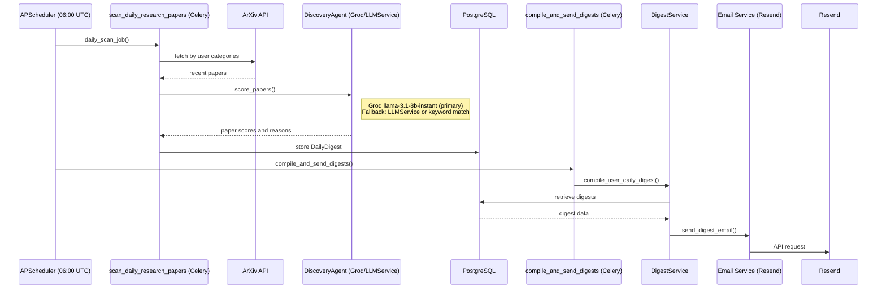
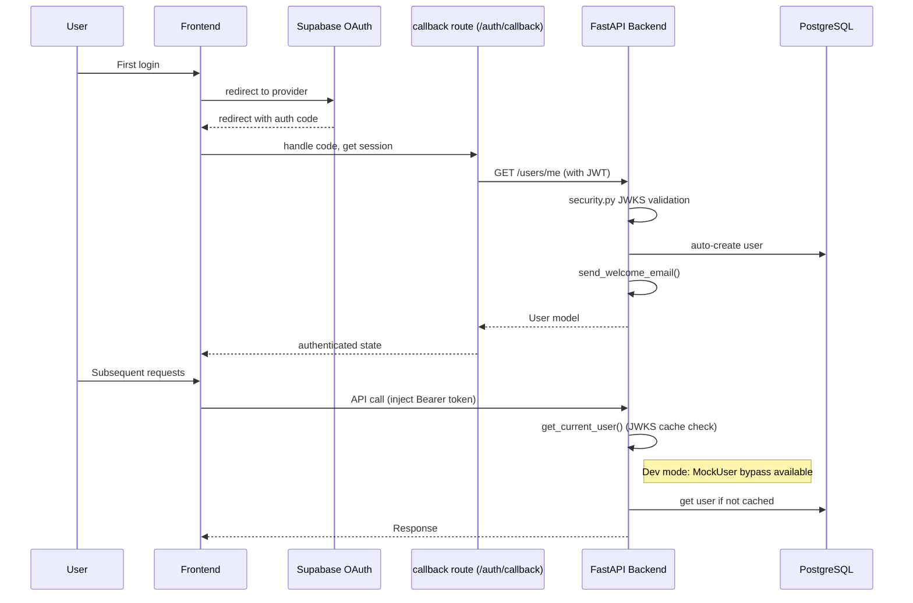
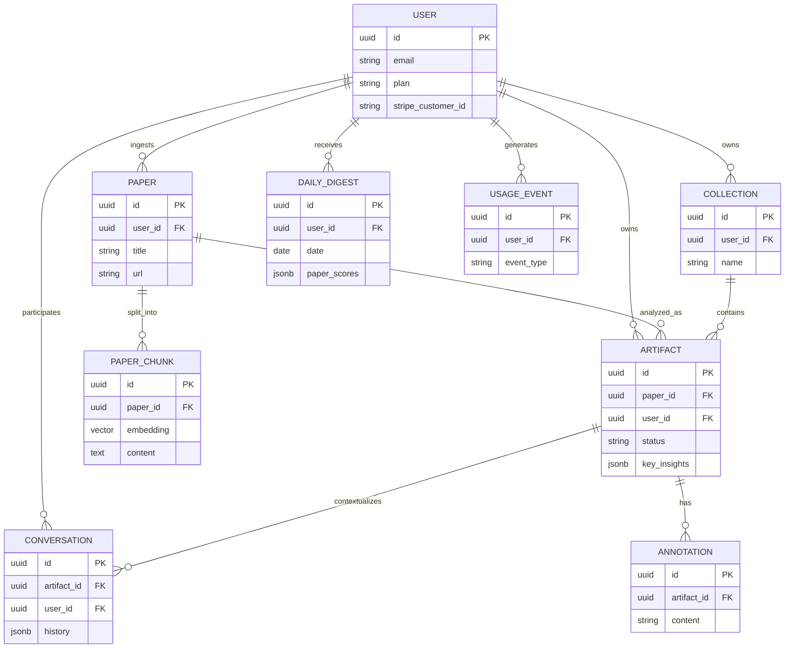
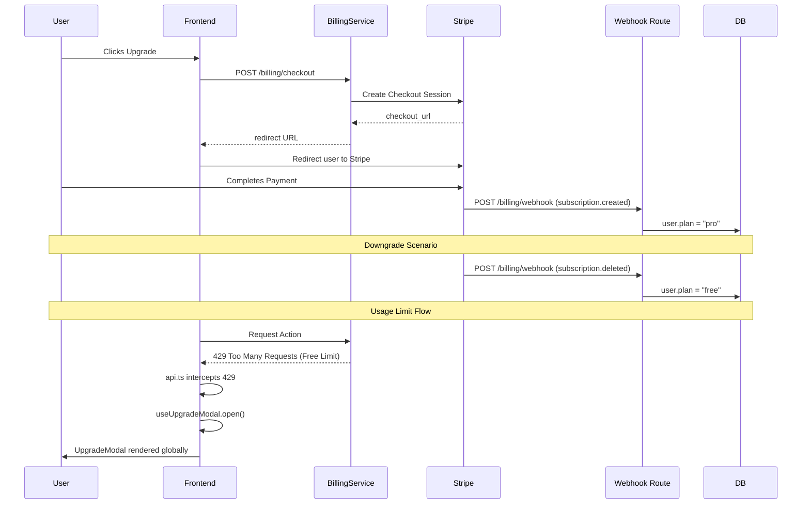

# Architecture Documentation

## 1. System Overview (C4 Context Level)
This diagram provides a high-level view of the entire Shouko-AI system. It shows the primary user interacting with the Next.js frontend, which connects to the FastAPI backend. The backend manages background tasks via Celery and APScheduler, stores data in PostgreSQL (with pgvector), caches in Redis, and communicates with various external APIs (OpenRouter, Groq, ArXiv, Stripe, Resend) to deliver AI research capabilities.



## 2. Paper Ingestion Pipeline
This sequence details the paper ingestion and artifact generation process. It starts with the user submitting a paper URL. The backend downloads and parses the PDF, chunks the text, and stores the embeddings. Then, it triggers an asynchronous Celery task to generate an artifact using the ArtifactAgent (via OpenRouter's LLM), eventually marking the artifact as "ready".



## 3. RAG Chat Flow
This sequence describes how the user interacts with the generated artifact via chat. The frontend streams the response from the backend. The backend retrieves the most relevant paper chunks using pgvector, compiles a RAG prompt, and streams the response back to the user via the LLMService connected to OpenRouter.



## 4. Daily Discovery & Digest Flow
This diagram illustrates the automated daily process that scans for new research papers and sends personalized digests to users. The APScheduler triggers the daily job which fetches new papers from ArXiv, scores them using the DiscoveryAgent, and stores the results. A subsequent task compiles and emails the digests via Resend.



## 5. Authentication Flow
This diagram outlines the authentication mechanisms. It covers the initial sign-in via Supabase OAuth, user creation in the local database upon callback, and the standard Bearer token validation for subsequent API requests using JWKS. It also notes a developer bypass mode for local testing.



## 6. Full Backend Module Graph
This graph represents the modular architecture of the FastAPI backend. The codebase is organized into core components (config, DB, auth), services (business logic, external APIs), models (SQLAlchemy ORM), agents (AI logic with specific prompts), routers (API endpoints), and Celery tasks.

```mermaid
graph LR
    subgraph routers
        R_users[users.py]
        R_chat[chat.py]
        R_papers[papers.py]
        R_artifacts[artifacts.py]
        R_digests[digests.py]
        R_collections[collections.py]
        R_annotations[annotations.py]
        R_billing[billing.py]
    end

    subgraph services
        S_llm[llm_service.py]
        S_embed[embedding_service.py]
        S_pdf[pdf_service.py]
        S_ingest[ingestion_service.py]
        S_rag[rag_service.py]
        S_digest[digest_service.py]
        S_billing[billing_service.py]
        S_email[email_service.py]
    end

    subgraph agents
        A_artifact[artifact_agent.py]
        A_discovery[discovery_agent.py]
    end

    subgraph prompts
        P_artifact[artifact_generation.py]
        P_discovery[discovery.py]
        P_rag[rag_qa.py]
    end

    subgraph models
        M_user[user.py]
        M_paper[paper.py]
        M_chunk[chunk.py]
        M_artifact[artifact.py]
        M_conversation[conversation.py]
        M_digest[digest.py]
        M_collection[collection.py]
        M_annotation[annotation.py]
        M_usage[usage.py]
    end

    subgraph core
        C_config[config.py]
        C_db[database.py]
        C_security[security.py]
        C_celery[celery_app.py]
        C_deps[dependencies.py]
        C_sched[scheduler.py]
        C_redis[redis.py]
        C_limit[rate_limit.py]
    end

    subgraph tasks
        T_artifact[generate_artifact.py]
        T_digest[digest_tasks.py]
    end

    routers --> services
    routers --> core
    routers --> models
    services --> core
    services --> models
    agents --> services
    agents --> prompts
    tasks --> agents
    tasks --> services
    tasks --> core
```



## 7. Frontend Component Tree
This chart visualizes the Next.js frontend structure. It highlights the App Router layout hierarchy, primary pages (dashboard, library, digest, artifact), shared UI components, and the underlying custom hooks and API layer.

```mermaid
graph TD
    Root[app/layout.tsx] --> Providers[providers.tsx]
    Providers --> UpgradeModal[UpgradeModal.tsx]

    Root --> DashboardLayout[(dashboard)/layout.tsx]
    DashboardLayout --> Sidebar[Sidebar.tsx]
    DashboardLayout --> MobileHeader[MobileHeader.tsx]

    DashboardLayout --> DashboardPage[dashboard/page.tsx]
    DashboardLayout --> LibraryPage[library/page.tsx]
    DashboardLayout --> CollectionsPage[collections/page.tsx]
    DashboardLayout --> SettingsPage[settings/page.tsx]
    DashboardLayout --> DigestPage[digest/page.tsx]
    DashboardLayout --> ArtifactPage[artifact/:id/page.tsx]

    DigestPage --> PaperCard[PaperCard.tsx]

    ArtifactPage --> StatusBadge[StatusBadge.tsx]
    ArtifactPage --> InsightsList[InsightsList.tsx]
    ArtifactPage --> SuggestedExperiments[SuggestedExperiments.tsx]
    ArtifactPage --> AutoQA[AutoQA.tsx]
    ArtifactPage --> AnnotationsTab[AnnotationsTab.tsx]
    ArtifactPage --> ChatPanel[ChatPanel.tsx]

    ChatPanel --> MessageList[MessageList.tsx]
    MessageList --> StreamingMessage[StreamingMessage.tsx]
    ChatPanel --> MessageInput[MessageInput.tsx]

    subgraph Shared
        UsageBanner[UsageBanner.tsx]
        EmptyState[EmptyState.tsx]
        ErrorBoundary[ErrorBoundary.tsx]
    end

    subgraph Hooks
        useUser
        useArtifact
        useDigest
        useSSEChat
        useUpgradeModal
    end

    subgraph API
        api_client[lib/api.ts]
    end

    Hooks --> api_client
```

## 8. Data Model ERD
This Entity-Relationship Diagram defines the relational structure in the PostgreSQL database. It displays the central User table and its links to collections, artifacts, papers (with chunks for RAG), conversations, and billing events.



## 9. Billing Flow
This diagram details the upgrade process and usage limit enforcement. Users can initiate a checkout via Stripe, with webhooks asynchronously updating their plan. Free-tier limits trigger interceptors that show the UpgradeModal globally.


